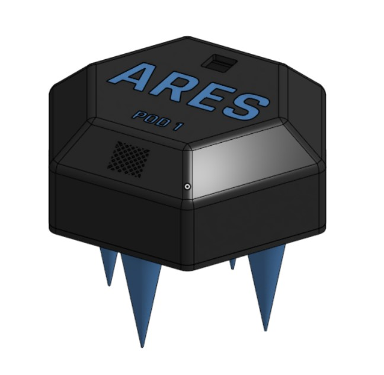
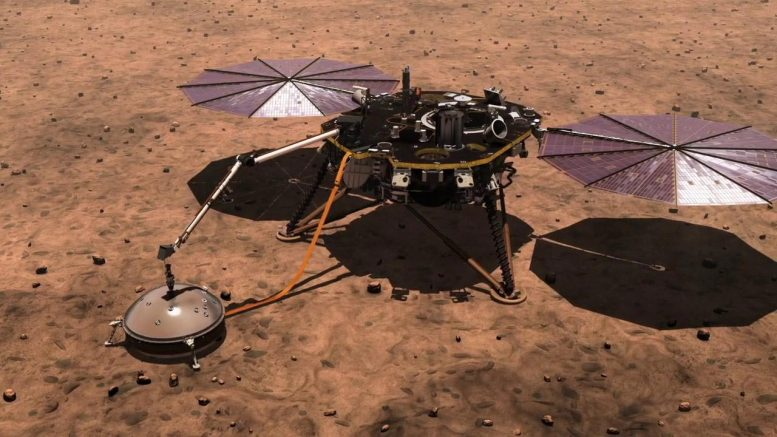
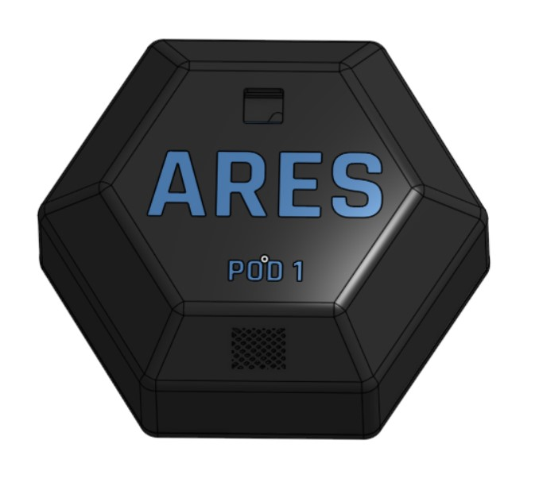
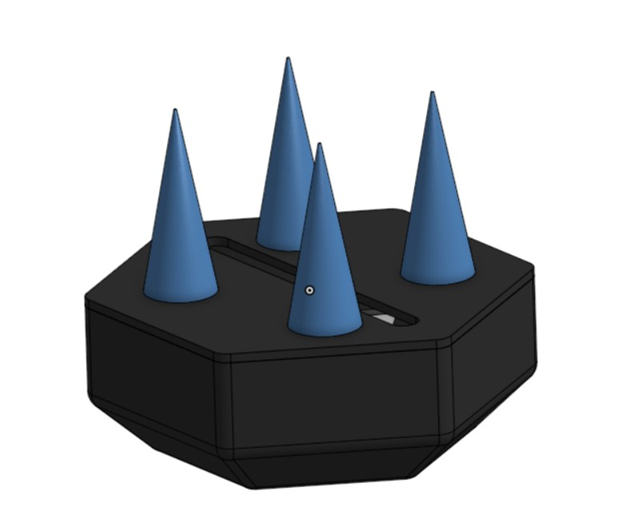
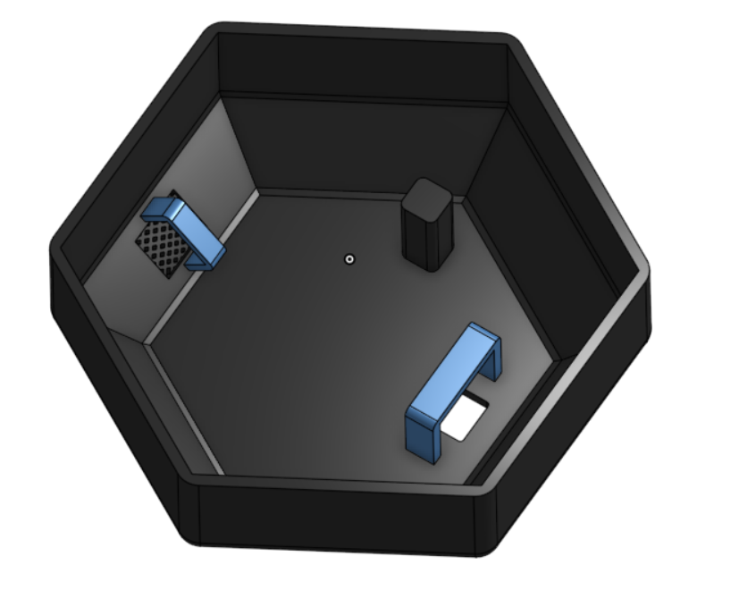
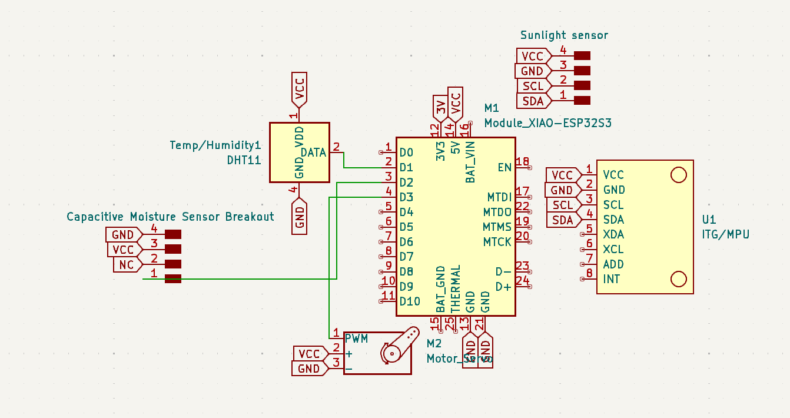
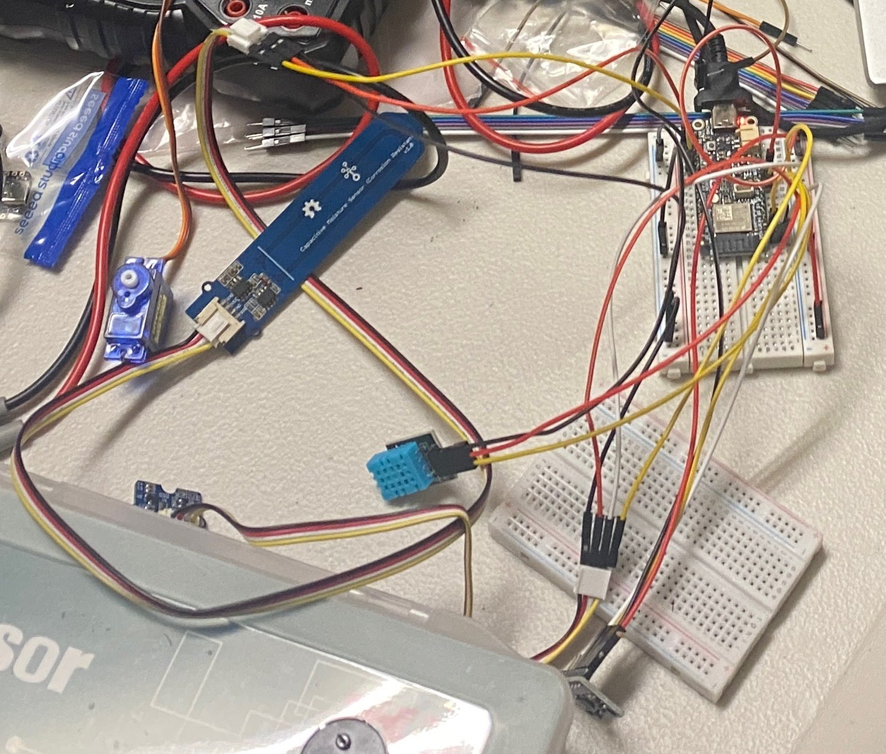
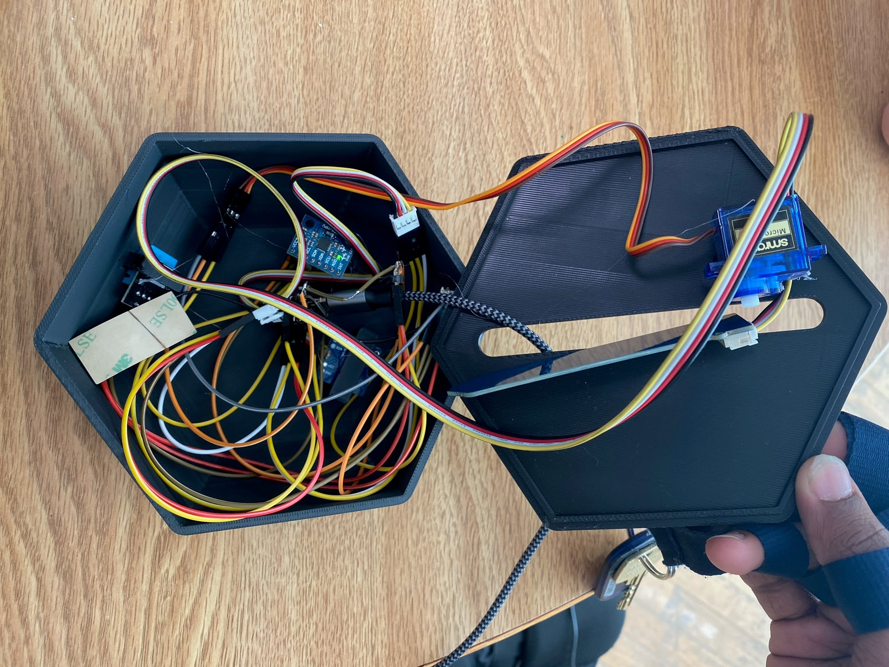

# ARES-M: Atmospheric Remote Environmental System for Mars

**SMathHacks 2025 - Hardware Track Winner** 🏆

ARES is a remote autonomous sensor suite for Mars, monitoring temperature, humidity, seismic activity, UV/IR, and soil moisture in real time to advance planetary science and environmental research.

## Team Members

- [**Richard Shan**](mailto:richardmshan@gmail.com) - Hardware Lead
- [**Aaditya Sah**](mailto:sah26a@ncssm.edu) - Software Engineer
- [**Trevor Bedson**](mailto:bedson26t@ncssm.edu) - Full-Stack Developer
- [**Josh Chilukuri**](mailto:chilukuri26j@ncssm.edu) - Systems Integration

*Developed at [SMathHacks 2025](https://smathhacks-2025.devpost.com/) (February 8-9, 2025)*

## Overview

ARES is an integrated hardware-software solution featuring a remote sensor suite to detect temperature, humidity, seismic activity, and soil moisture monitoring on Mars. The nature of ARES' scalable mesh network deployment enables real-time environmental data acquisition across a distributed sensor array on multiple varied geographic locations simultaneously. A geospatially interactive interface allows users to access and analyze live telemetry along with a visualization of recently recorded data.

<p align="center">
  
</p>

## Inspiration

The idea for ARES emerged from the need for a more efficient and scalable approach to environmental monitoring on Mars. Existing planetary weather stations such as NASA's InSight lander and Curiosity's REMS provide valuable atmospheric and seismic data but are limited in coverage and flexibility. InSight, for example, offers stationary readings from a single location, while Curiosity's sensors can only gather data wherever the rover happens to be.

<p align="center">
  
</p>

These limitations pose challenges for understanding global weather patterns, seismic activity, and potential water presence on Mars. Given the planet's extreme conditions—dust storms, drastic temperature shifts, and geological activity—there is a critical need for a distributed, autonomous sensor system capable of continuous real-time data collection across multiple locations.

ARES was designed to address these challenges through a scalable mesh network of remote sensor pods that can be deployed across varied Martian terrain. These pods continuously monitor temperature, humidity, seismic activity, and soil moisture, providing high-resolution environmental data to researchers.

## Key Features

- 🌡️ **Temperature & Humidity Monitoring** - Real-time atmospheric conditions
- 📡 **UV/IR Radiation Detection** - Solar radiation and atmospheric analysis
- 🌍 **Seismic Activity Monitoring** - Earthquake and tremor detection
- 💧 **Soil Moisture Analysis** - Water content assessment
- 🔗 **Mesh Network Communication** - Scalable multi-pod deployment
- 🗺️ **Geospatial Visualization** - Interactive Mars mapping interface
- 🤖 **AI Integration** - Real-time processing and anomaly detection

## Hardware Design

### CAD Model

We created a hexagonal case for our electronics, with spots on the top for the sunlight and temperature/humidity sensor, as those needed access to light or the air respectively. We created an opening on the bottom of the hexagonal case for the soil moisture sensor to be deployed from.

<p align="center">
  
  
</p>

Spikes were added on the bottom as a way for the device to mount into extraterrestrial soil when dropped from a decent height, and serves to secure the device in place during dangerous Martian conditions such as storms and earthquakes.

### Internal Architecture

<p align="center">
  
</p>

Internally, we designed mounts for:
- **Temperature/Humidity Sensor** (left side) - Protected by mesh for air access
- **Sunlight Sensor** (right side) - Faces upward with clear protective tape
- **MPU6050 Accelerometer/Gyroscope** - Mounted directly for seismic detection
- **Servo Motor** - For soil moisture probe deployment

### Electrical Engineering

<p align="center">
  
</p>

We developed the circuit using an ESP32 architecture for its native Wi-Fi capabilities, allowing wireless data transmission. The system was initially prototyped on a breadboard before final integration.

<p align="center">
  
  
</p>

## Technology Stack

### Hardware
- **Xiao Seeed ESP32S3** - Main microcontroller
- **Temperature/Humidity Sensor** - Atmospheric monitoring
- **UV/IR Light Sensor** - Solar radiation detection
- **MPU6050** - Accelerometer/gyroscope for seismic activity
- **Soil Moisture Sensor** - Water content analysis
- **Servo Motor** - Probe deployment mechanism

### Software
- **Frontend**: Next.js, TypeScript, Tailwind CSS
- **Backend**: Node.js, Prisma ORM
- **Database**: PostgreSQL
- **Hardware**: Arduino C++ (ESP32)
- **Deployment**: Docker, Docker Compose

## Getting Started

### Prerequisites

- Node.js 18+
- Docker and Docker Compose
- Arduino IDE (for hardware programming)

### Installation

1. **Clone the repository**
   ```bash
   git clone https://github.com/Prorickey/smathhacks25.git
   cd smathhacks25
   ```

2. **Install dependencies**
   ```bash
   npm install
   ```

3. **Start the database**
   ```bash
   docker run --name mars-weather-db -p 5432:5432 -e POSTGRES_PASSWORD=pass -e POSTGRES_DB=weather -e POSTGRES_USER=mars -d postgres
   ```

4. **Run database migrations**
   ```bash
   npx prisma migrate deploy
   ```

5. **Start the development server**
   ```bash
   npm run dev
   ```

6. **Access the application**
   Open [http://localhost:3000](http://localhost:3000) in your browser

### Docker Deployment

Alternatively, use Docker Compose for a complete setup:

```bash
docker-compose up -d
```

## API Documentation

The system provides real-time sensor data through RESTful endpoints:

- `GET /api/sensors` - Retrieve all sensor data
- `GET /api/sensors/{id}` - Get specific sensor readings
- `POST /api/sensors` - Submit new sensor data (from ESP32)

## Impact & Applications

ARES provides critical capabilities for:

- **Climate Research** - Understanding Martian weather patterns
- **Habitat Planning** - Site selection for future missions
- **Safety Monitoring** - Early warning systems for extreme weather
- **Water Detection** - Identifying potential water sources
- **Geological Research** - Seismic activity mapping

## Future Development

- **Extended Sensor Array** - VOC, CO₂, and particulate matter sensors
- **Solar Power Integration** - Self-sustaining power systems
- **Advanced AI Analytics** - Predictive weather modeling
- **Satellite Communication** - Long-range data transmission
- **Autonomous Deployment** - Drone-based pod distribution

## Contributing

We welcome contributions! Please read our contributing guidelines and submit pull requests for any improvements.

## License

This project is licensed under the MIT License - see the [LICENSE](LICENSE) file for details.

## Acknowledgments

- **SMathHacks 2025** organizers and sponsors
- **NASA** for inspiration from InSight and Curiosity missions
- **North Carolina School of Science and Mathematics** for resources and support

---

*Built with ❤️ for Mars exploration and the future of space science*
